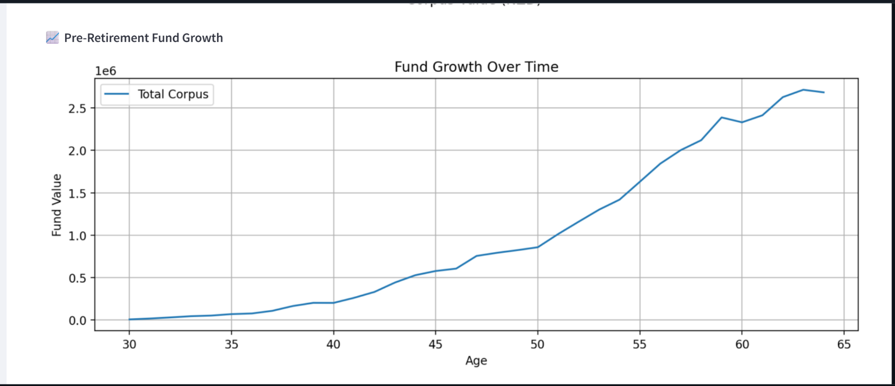
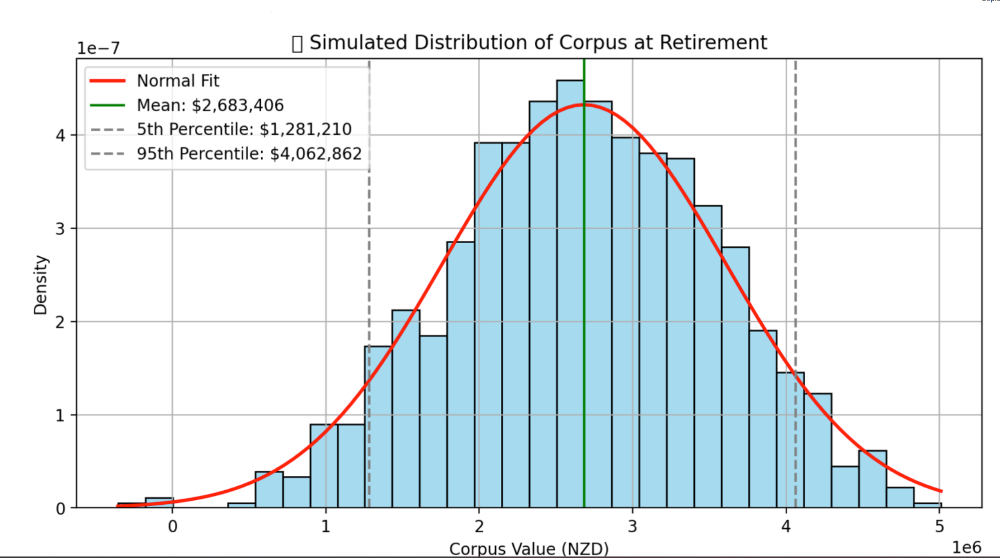
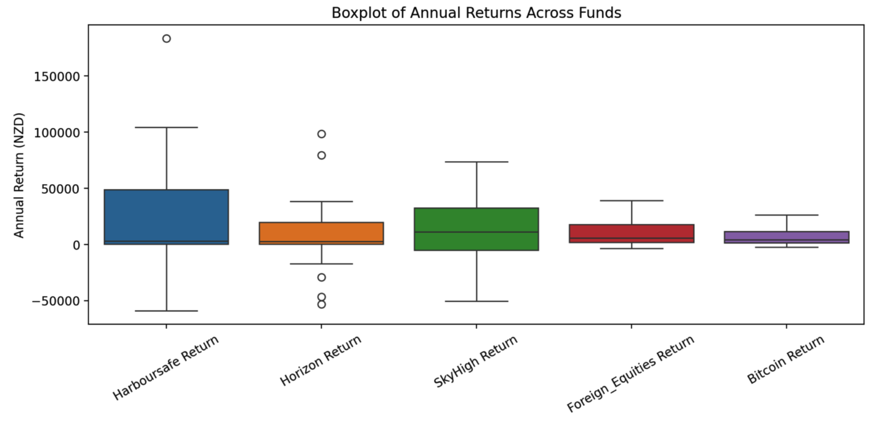
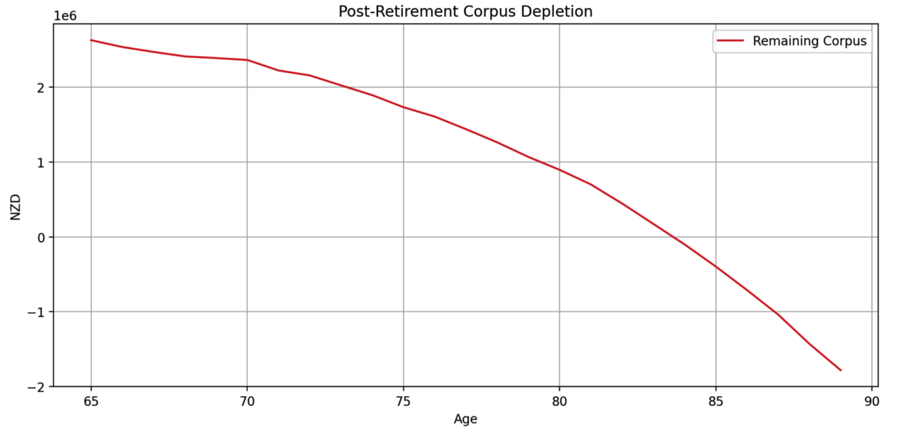

# NZ Retirement Portfolio Simulator

A comprehensive Excel-based financial modelling engine for long‑term retirement planning in New Zealand. This project integrates salary progression, tax rules, investment allocations, lifestyle cost forecasting, and scenario planning to estimate retirement outcomes under uncertainty.

## Overview

This simulator models an individual's financial journey from age 30 to 65 and beyond, helping to evaluate whether a retirement corpus will support a desired lifestyle. It uses probabilistic methods and scenario planning to quantify uncertainty and provide insights for decision‑making.

## Key Components

- **Salary & Tax Modelling**: Forecasts salary growth over 35 years with probabilistic raises, applying NZ income tax brackets and ACC levies. Contributions grow over time with periodic increases and lump‑sum injections.
- **Investment Portfolio Engine**: Allocates savings across bonds, balanced funds, equities, foreign equities and bitcoin with expected return and volatility assumptions. A glide path adjusts allocations as the individual approaches retirement.
- **Lifestyle & Expense Forecasting**: Projects spending across categories (housing, groceries, travel, etc.) using statistical distributions and inflation. Handles transitions from renting to home ownership and upgrades every few years.
- **Scenario Planning**: Includes baseline, optimistic, bear and stochastic scenarios incorporating promotions, partner income, house purchase, child expenses, break periods and emergency withdrawals.
- **Monte Carlo Simulation**: Runs 5,000+ iterations to simulate portfolio growth and drawdown, producing distributions of retirement corpus values and confidence intervals.

## Sample Visuals

These charts illustrate some outputs generated by the model:









## Repository Structure

```
excel_models/
├── nz_retirement_model_base.xlsx      # Salary projection and contribution sufficiency model
├── nz_retirement_model_scenarios.xlsx # Scenario engine with Monte Carlo simulation
images/
├── pre_retirement_growth.png
├── corpus_distribution.png
├── fund_returns_boxplot.png
└── corpus_depletion.png
README.md
```

## How to Use

1. Clone the repository.
2. Open `excel_models/nz_retirement_model_base.xlsx` to explore salary projections, contribution sufficiency and basic corpus calculations.
3. Open `excel_models/nz_retirement_model_scenarios.xlsx` to run the scenario engine and Monte Carlo simulation. Adjust assumptions in the input sheets and review results on the summary sheets.
4. View the charts in the `images/` folder for quick insights.

## Key Insights

- A conservative contribution strategy results in a projected corpus of around $800 k, far short of the estimated $2.7 M needed for retirement.
- Including promotions, higher contributions, partner income and favorable market conditions can grow the corpus to over $7 M.
- Under challenging scenarios involving house purchase, child expenses and career breaks, the corpus still reaches around $1.8 M–$1.9 M.
- A realistic stochastic case projects a corpus of $4.6 M–$4.8 M, demonstrating the power of disciplined saving, diversified investing and periodic lifestyle adjustments.

## Tech Stack

- Microsoft Excel (financial modelling & Monte Carlo simulation)
- Statistical modelling (normal and beta distributions)
- Git (version control)

---

This project demonstrates advanced retirement modelling techniques tailored to New Zealand superannuation rules. Feel free to explore the models and adapt them to your own assumptions or regions.
